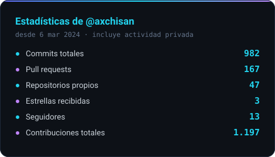
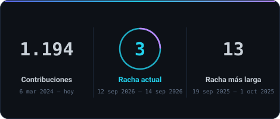

<picture>
  <source media="(prefers-color-scheme: dark)" srcset="./assets/banner-dark.svg">
  <source media="(prefers-color-scheme: light)" srcset="./assets/banner-light.svg">
  
</picture>

<p align="center">
  <a href="https://axchisan.com"></a>
  <a href="https://www.linkedin.com/in/duvan-arciniegas"></a>
  <a href="mailto:axchisan923@gmail.com"></a>
  
</p>

---

## Sobre mí

Desarrollador de software **autodidacta**, tecnólogo en Análisis y Desarrollo de Software (SENA).
Llevo más de **3 años construyendo producto**: primero como freelance para clientes reales, hoy también en equipo dentro de la industria.

No me caso con un stack. Me interesa el problema: si hay que levantar un microservicio en **Spring Boot**, una app en **Flutter**, un frontend en **Next.js** o un worker de render en **Python**, se hace bien y se despliega.

```yaml
rol:        Desarrollador de Software · Full-Stack
enfoque:    Backend distribuido · Apps multiplataforma · Automatización e IA
actualidad: microservicios Java/Spring Boot para core financiero (CI/CD en Azure DevOps)
paralelo:   producto propio — juegos educativos, workers de medios, herramientas internas
ubicacion:  Bogotá, Colombia 🇨🇴
idiomas:    [Español (nativo), Inglés (B1)]
marca:      Axchi
```

- 🎯 Me muevo cómodo en **todo el ciclo**: modelo de datos → API → interfaz → despliegue.
- 🧩 Me gusta lo que **queda funcionando en producción**, no la demo bonita.
- 🎮 Debilidad confesa: **desarrollo de videojuegos** y programación creativa.
- 🤖 Integro **agentes de IA** y automatizaciones en flujos reales de trabajo, no como adorno.

---

## Stack

**Backend**

<p>
  
  
  
  
  
  
</p>

**Frontend & Mobile**

<p>
  
  
  
  
  
  
</p>

**Datos & Infraestructura**

<p>
  
  
  
  
  
  
  
  
</p>

**Herramientas**

<p>
  
  
  
  
  
  
</p>

---

## Estadísticas

<p align="center">
  <picture>
    <source media="(prefers-color-scheme: dark)" srcset="./assets/stats-dark.svg">
    <source media="(prefers-color-scheme: light)" srcset="./assets/stats-light.svg">
    
  </picture>
  <picture>
    <source media="(prefers-color-scheme: dark)" srcset="./assets/langs-dark.svg">
    <source media="(prefers-color-scheme: light)" srcset="./assets/langs-light.svg">
    
  </picture>
</p>

<p align="center">
  <picture>
    <source media="(prefers-color-scheme: dark)" srcset="./assets/streak-dark.svg">
    <source media="(prefers-color-scheme: light)" srcset="./assets/streak-light.svg">
    
  </picture>
</p>

<p align="center"><sub><i>Tarjetas generadas desde este mismo repositorio con GitHub Actions — sin depender de servicios de terceros. La de lenguajes ignora los repos donde se versionaron dependencias externas (<code>venv/</code>, <code>vendor/</code>), para que mida código escrito y no librerías descargadas.</i></sub></p>

---

## Proyectos destacados

| Proyecto | Qué es | Stack |
|---|---|---|
| **[Quanta](https://github.com/axchisan/quanta2)** | Juego educativo de Física y Química con IA generativa, multijugador en tiempo real y editor de retos. Monorepo pnpm + Turborepo. | `TypeScript` `Next.js 15` `Phaser 3` `Colyseus` `Supabase` |
| **[Gestión de Inventario SENA](https://github.com/axchisan/GestionInventarioSENA)** | Sistema integral de inventario para ambientes de formación: app móvil + API + control de préstamos y mantenimientos. | `Flutter` `FastAPI` `PostgreSQL` |
| **[Carnets Virtuales SENA](https://github.com/axchisan/AppGestionCarnetsSENA)** | Carnet digital con código de barras, funcional offline, que interopera con una app de escritorio en Java para validar el ingreso. | `Flutter` `Java` `PostgreSQL` |
| **[Bitácoras SENA](https://github.com/axchisan/bitacoras-sena)** | Automatiza las bitácoras de etapa productiva: lee work items de Azure DevOps, redacta con IA y genera el Excel oficial. | `Python` `FastAPI` `Azure DevOps API` `IA` |
| **[media-worker](https://github.com/axchisan/media-worker)** | Microservicio de medios: texto → voz con timing por palabra y render de vídeo vertical 1080×1920 con subtítulos karaoke. | `Python` `FFmpeg` `edge-tts` `Docker` |
| **[Fudoshin Ryu](https://github.com/axchisan/Fudoshin-Ryu)** | Sitio oficial de un dojo de Shotokan Karate-Do afiliado a la JKA, con tres sedes reales en Santander. | `TypeScript` `Next.js` `Tailwind` |

<sub>También tengo proyectos entregados a clientes reales (odontología, restaurantes, hotelería), automatizaciones internas y experimentos con motores de videojuegos. Hay más en la pestaña <a href="https://github.com/axchisan?tab=repositories">repositories</a>.</sub>

---

## Ahora mismo

```text
▸ Construyendo   Quanta — juego educativo con IA y multiplayer
▸ Aprendiendo    arquitectura de microservicios, observabilidad y AWS
▸ Explorando     agentes de IA aplicados a flujos de trabajo reales
▸ Abierto a      colaboraciones, freelance y proyectos con propósito
```

---

<details>
<summary><b>Cómo está hecho este perfil</b></summary>

<br>

Las tarjetas de arriba no vienen de ningún servicio externo: las genera
[`scripts/generate-stats.mjs`](./scripts/generate-stats.mjs), un script de Node sin dependencias que
consulta la API GraphQL de GitHub y escribe los SVG en `assets/`. Un
[workflow](./.github/workflows/stats.yml) lo ejecuta dos veces al día y commitea el resultado.

Lo hice así por tres razones:

1. **No se cae.** Las instancias públicas de los generadores de tarjetas viven en rate limit y dejan
   miles de perfiles con imágenes rotas.
2. **Los números son honestos.** El reparto de lenguajes de GitHub cuenta los megabytes de
   dependencias que alguien versionó por error. Aquí esos repos se excluyen explícitamente.
3. **Nada queda invisible.** Los SVG no usan `opacity: 0` esperando una animación: la app móvil y los
   lectores con *reduced motion* no la ejecutan y la tarjeta saldría en blanco.

</details>

---

<p align="center">
  <b>¿Tienes una idea? Hablemos.</b><br>
  <a href="https://axchisan.com">axchisan.com</a> ·
  <a href="mailto:axchisan923@gmail.com">axchisan923@gmail.com</a> ·
  <a href="https://www.linkedin.com/in/duvan-arciniegas">LinkedIn</a>
</p>

<p align="center"><sub>Hecho con café ☕ desde Colombia</sub></p>
